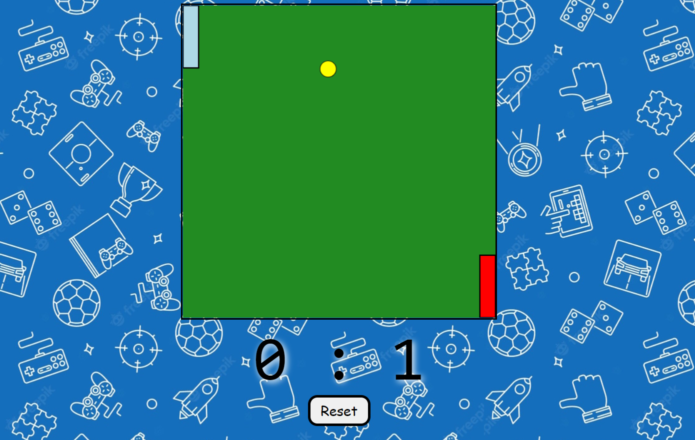

# Pong-Game-JS
This is a study aiming for making some practice with HTML-CSS-JavaScript.    
Click <a href="https://buraxta.github.io/Pong-Game-JS/" target="_blank">here</a> to see the project. Here's a snapshot:  
The player on the left should use 'W' and 'S' keys to move the paddle whereas the player on the right side should  use 'Up' and 'Down' arrow to move the paddle.    

